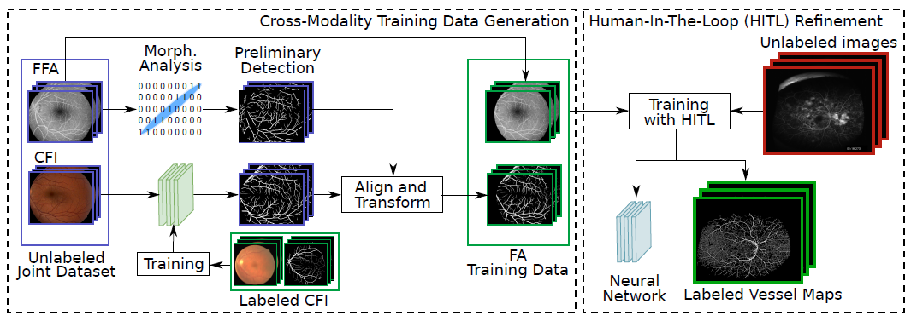

# DeepVesselSeg4FA
This repository contains code for evaluating the retinal vessel segmentation and replicating results from the associated paper:

Li Ding, Mohammad H. Bawany, Ajay E. Kuriyan, Rajeev S. Ramchandran, Charles C. Wykoff, and Gaurav Sharma,
"A Novel Deep Learning Pipeline for Retinal Vessel Detection In Fluorescein Angiography",
IEEE Transactions on Image Processing, vol. 29, no. 1, 2020, accepted for publication, to appear.

<p align="justify">
<a href="http://www.ece.rochester.edu/~gsharma/papers/Ding_FAVesselDetPipeline_TIP2020.pdf">[Paper]</a>
<a href="http://www.ece.rochester.edu/~gsharma/papers/Suppl_Ding_FAVesselDetPipeline_TIP2020.pdf">[Supplementary]</a>
<a href="https://doi.org/10.21227/m9yw-xs04">[Dataset]</a>
<a href="url">[Code Ocean capsule]</a>
<a href="url">[Project Website]</a>
</p>



## Dependencies
The program requires Python 3.x and the following packages:
* PyTorch v0.4.1
* torchvision v0.2.2
* OpenCV-Python 
* NumPy
* scikit-learn
* scikit-image
* Pillow

Running on GPU is highly recommended.

## Run the Program using Code Ocean
We recommend using the Code Ocean version of this program, which can be run using Code Ocean's built-in interface. The code is available [here](https://).

## Detect Retinal Vessels using the provided Pre-trained Model
To run the FA vessel detection using the pre-trained model, go to `./code` folder and execute the bash script
```bash
./run_detect_FA_vessels_w_DNN.sh
```
The results will be saved to `./results`. This folder will be automatically generated if it does not exist. Please see the comments in `./run_detect_FA_vessels_w_DNN.sh` for parameter settings. The detected retinal vessel maps are saved as PNG images in `./results`. The filename `predicted_Img*png` against the corresponding ground truth vessel map available in the folder `./dataset` where the name of the ground truth file is `Label*.png`

By default, the code demonstrates the vessel detection on the image `./datasets/single_sample_from_RECOVERY-FA19/Images_RECOVERY-FA19/Img08_RECOVERY-FA19.tif`, which corresponds to the second image in Fig. 9 in the above mentioned paper. The predicted vessel map is stored in `./results/predicted_Img08_RECOVERY-FA19.png`. The trained model used for obtaining the segmentation is provided as `pretrained_models/model_8.pth` and corresponds to the model used for generating the results for this image for Table II of the above paper. That is, it is the model from the leave-one-out cross-validation procedure that was trained on the remaining 7 images in the RECOVERY-FA19 dataset (see paper for details).

## Evaluate Detected Vessel Maps

Once the vessel detection is completed using the above process, several evaluation metrics (see paper for details) can be computed for the detected vessel maps by comparing the detected vessel maps against provided ground-truth vessel labels. In order to perform the evaluation, go to `./code` folder and execute the bash script
```bash
./run_eval_seg_vs_gt.sh
```

Summary statistics from the evaluation will be displayed on the screen. By default, if you perform these two steps in sequence, the code will perform the evaluation for the predicted vessel map `./results/predicted_Img08_RECOVERY-FA19.png` using the corresponding ground-truth labeled image `./datasets/single_sample_from_RECOVERY-FA19/Labels_RECOVERY-FA19/Label08_RECOVERY-FA19.png`.

If the full RECOVERY-FA19 dataset is downloaded in the dataset folder (see following section for instructions), with a minor modification, the evaluation script (and detected vessel maps provided with the code) also allow you to replicate the results reported in Table 2 of the paper. Please see the comments in `./run_eval_seg_vs_gt.sh` for parameter settings and the minor changes required. Note that the results in Table 2 of the paper are obtained with a leave-one-out cross validation procedure and to allow replication of the results in the table, we provide the full set of the detected vessel maps obtained using the leave-one-out cross validation in `./pretrained_results/`. 

## Datasets
As indicated above, by default, the code runs on one sample ultra-widefield fluorescein angiography (FA) image from the RECOVERY-FA19 dataset that is included with the code repository. If you would like to run the code on all images in the RECOVERY-FA19 dataset, please download the entire dataset from the [IEEE DataPort](https://doi.org/10.21227/m9yw-xs04) and place them in an appropriate directory structure as indicated by the instructions in the file `./datasets/README.md`.


## Citation
If you use the code or the RECOVERY-FA19 dataset, please cite:
```BibTex
@ARTICLE{Ding_2020_TIP_DeepVesselSeg4FA,
author={L. Ding and M. H. Bawany and A. E. Kuriyan and R. S. Ramchandran and C. C. Wykoff and G. Sharma},
journal={IEEE Transactions on Image Processing}, 
title={A Novel Deep Learning Pipeline for Retinal Vessel Detection In Fluorescein Angiography},
year={2020},
volume={29},
number={1},
note={accepted for publication, to appear},
}
```
